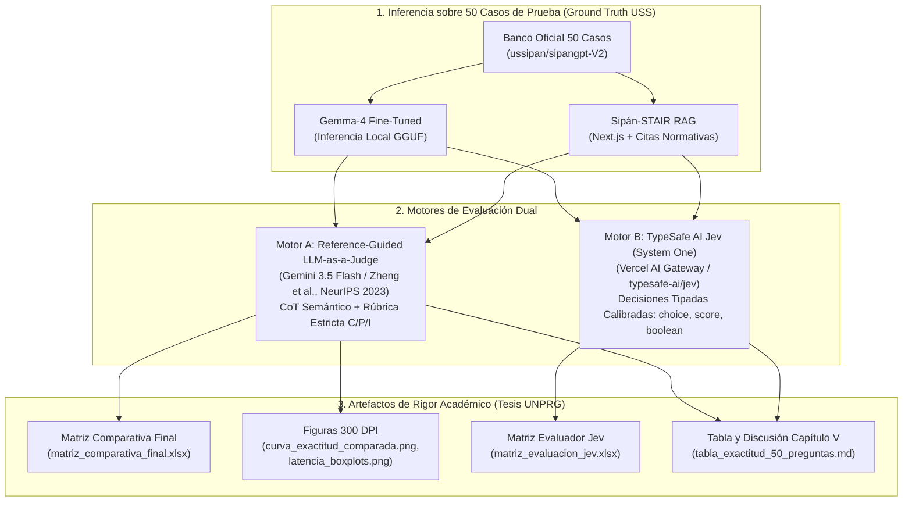

# Suite de Evaluación Comparativa de Rigor Científico: Gemma-4 Fine-Tuned vs. Sipán-STAIR (RAG)

[](https://www.python.org/downloads/)
[](https://docs.pydantic.dev/)
[](https://mypy.readthedocs.io/)
[](https://arxiv.org/abs/2306.05685)
[](https://ai-gateway.vercel.sh)

Este repositorio contiene la suite de evaluación automatizada, científica y reproducible desarrollada para el informe de tesis de la **Universidad Nacional Pedro Ruiz Gallo (UNPRG)**. El objetivo principal es evaluar cuantitativa y cualitativamente el desempeño de dos aproximaciones tecnológicas para asistentes virtuales académicos en la **Universidad Señor de Sipán (USS)**:

1. **Gemma-4 Fine-Tuned (LoRA):** Modelo de lenguaje adaptado localmente mediante cuantización GGUF Q4_K_M ejecutado en Apple Silicon.
2. **Sipán-STAIR (RAG Architecture):** Sistema de Generación Aumentada por Recuperación con citación contextual, reranking y verificación fáctica sobre Next.js y PostgreSQL.

---

## 🔬 Arquitectura de Evaluación Dual: LLM Judge + Jev System One

Para garantizar determinismo científico, eliminar sesgos y proveer doble validación algorítmica, la suite implementa dos motores evaluadores independientes:



---

### Motor A: Reference-Guided LLM-as-a-Judge (Gemini 3.5 Flash)

Siguiendo el estándar de oro de **NeurIPS 2023** (*"Judging LLM-as-a-Judge with MT-Bench and Chatbot Arena"* por Lianmin Zheng et al., UC Berkeley / LMSYS), se sustituyó la coincidencia superficial de palabras clave (*keyword matching* / BLEU / ROUGE) por una **Evaluación Guiada por Referencia (*Reference-Guided Grading*)**.

- **¿Por qué falla la coincidencia tradicional de palabras clave?**  
  Si un estudiante consulta *«¿Puedo pagar con tarjeta?»* y el modelo responde *«No puedes pagar con tarjeta»*, la superposición léxica supera el 90%, pero la respuesta es **100% incorrecta e inversa**.
- **Implementación del Juez:**  
  Utiliza **Gemini 3.5 Flash** (`gemini-3.5-flash`) con salida estructurada JSON validada bajo Pydantic v2 a temperatura 0.0, analizando:
  1. Pregunta del Estudiante USS.
  2. Respuesta Oficial de Referencia (Ground Truth).
  3. Respuesta Generada por el Modelo a Contrastar.
  4. Detección explícita de alucinaciones y omisiones fácticas.

#### 📐 Definición Rigurosa de las Etiquetas de Calificación (C, P, I)

| Etiqueta | Nombre | Valor | Criterio Operativo (Zheng et al., NeurIPS 2023) |
| :---: | :---: | :---: | :--- |
| **C** | **Correcta** | `1.0 pt` | **Exactitud total y suficiencia operativa.** La respuesta contiene el dato fáctico exacto (fechas, montos, requisitos) o los pasos correctos del flujo según la referencia. No presenta alucinaciones ni omisiones que impidan al estudiante resolver su trámite. *(En RAG, además incluye la cita o enlace al documento oficial).* |
| **P** | **Parcial** | `0.5 pt` | **Coherente pero incompleta.** La orientación general es acertada, pero omite un paso intermedio importante (ej. indica cómo pagar pero no dónde validar el váucher), es ambigua en plazos/requisitos secundarios, o presenta imprecisiones leves sin llegar a ser una falsedad grave. |
| **I** | **Incorrecta** | `0.0 pt` | **Alucinación fáctica o contradicción.** El modelo inventa un procedimiento, plataforma o costo inexistente; contradice abiertamente el manual oficial; o da una respuesta evasiva que provocaría un error operativo en el estudiante. |

---

### Motor B: TypeSafe AI Jev (System One Evaluation Model)

**Jev** es el primer modelo de evaluación de arquitectura **System One** desarrollado por **TypeSafe AI**, consumido vía **Vercel AI Gateway** (`typesafe-ai/jev`).

- **¿En qué se diferencia un modelo System One de un chatbot tradicional?**  
  Los LLMs conversacionales tradicionales (*System Two / generative chatbots*) generan texto libre secuencial token a token, lo que introduce variabilidad estilística y latencias de varios segundos. Jev, en contraste, lee el estado completo del programa (`state`) y emite **decisiones calibradas y tipadas** en una sola pasada de inferencia sub-segundo:
  1. **Primitiva `choice`:** Clasificación en opciones discretas (`C`, `P`, `I`) con distribución completa de probabilidades calibradas y puntuación de confianza (`confidence`).
  2. **Primitiva `boolean`:** Verificación probabilística directa (ej. `alucinacion: boolean` con probabilidad asociada de 0.0 a 1.0).
  3. **Primitiva `score`:** Graduación en una escala de 0 a 3 de calidad técnica y apego a la normativa institucional USS.
- **Ruta de Conexión:**  
  Vía Vercel AI Gateway utilizando la especificación experimental de evaluación (`experimental_evaluate` en Vercel AI SDK / endpoint `POST https://ai-gateway.vercel.sh/v1/evaluate`) autenticada mediante variable de entorno `VERCEL_AI_GATEWAY_KEY`.

---

## 📊 Resultados Oficiales del Benchmark (Capítulo V de la Tesis)

Resultados cuantitativos consolidados tras evaluar las **50 preguntas oficiales de prueba** distribuidas en los 5 módulos temáticos institucionales:

### 1. Tabla Comparativa General (Evaluación Dual)

| Métrica / Dimensión de Evaluación | Gemma-4 Fine-Tuned (LoRA) | Sipán-STAIR (RAG Architecture) | Diferencia / Impacto Fáctico |
| :--- | :---: | :---: | :---: |
| **Total de Preguntas de Prueba** | **50** | **50** | - |
| **Exactitud Juez Gemini 3.5 Flash (%)** | **14.00%** | **55.00%** | **+41.00% exactitud neta** |
| - Respuestas Correctas (C - 1.0 pt) | 3 (6.0%) | 22 (44.0%) | +38.0% |
| - Respuestas Parciales (P - 0.5 pt) | 8 (16.0%) | 11 (22.0%) | +6.0% |
| - Respuestas Incorrectas (I - 0.0 pt) | 39 (78.0%) | 17 (34.0%) | -44.0% |
| **Total Alucinaciones Detectadas (Juez Gemini)** | **40 (80.0%)** | **17 (34.0%)** | **-46.0% alucinaciones** |
| **Exactitud Calibrada Jev System One (%)** | **1.00%** | **26.00%** | **+25.00% a favor de RAG** |
| - Veredicto Jev Correcto ('C') | 0 (0.0%) | 5 (10.0%) | +10.0% |
| - Veredicto Jev Parcial ('P') | 1 (2.0%) | 16 (32.0%) | +30.0% |
| - Veredicto Jev Incorrecto ('I') | 49 (98.0%) | 29 (58.0%) | -40.0% |
| **Calidad Técnica Media Jev (0 a 3)** | **0.33** | **1.06** | **+0.73 puntos** |
| **Latencia Media de Inferencia del Asistente** | **11,893.38 ms** (~11.9s) | **91,755.90 ms** (~91.8s) | Mayor tiempo por retrieval + citas |
| **Latencia Media del Evaluador Jev** | **1,167.89 ms** | **1,167.89 ms** | Decisión estructurada rápida |

### 2. Gráficos de Alta Resolución Generados (300 DPI)

| Curva de Exactitud Comparada por Módulo | Distribución de Latencia de Inferencia (Boxplots) |
| :---: | :---: |
|  |  |

---

## 🖥️ Condiciones y Entorno Experimental

Para garantizar la **reproducibilidad científica** exigida en la sustentación de tesis:

1. **Hardware de Evaluación:** Mac Mini M4 (Apple Silicon, memoria unificada, arquitectura ARM64).
2. **Gemma-4 Fine-Tuned (LoRA):**
   - Inferencia local vía Ollama / LM Studio (`unsloth_gemma-4-E2B-it_1789791679-GGUF`).
   - Inferencia 100% offline sin dependencia de red.
3. **Sipán-STAIR (RAG Architecture):**
   - Servidor Next.js en puerto local 3000 (`/api/chat`).
   - Autenticación pre-compartida vía cabecera `x-api-key: sipangpt-local-perf-key` (usuario de rendimiento `benchmark-agent@sipangpt.local`).
   - Vector Store con PostgreSQL, pgvector y Prisma ORM.
4. **Tolerancia a Red Lenta y Checkpointing:**
   - Timeouts extendidos a 180 segundos por consulta.
   - Pacing y backoff exponencial para respetar cuotas de proveedores (Google Gemini y Vercel AI Gateway).
   - Persistencia continua en disco: ante cualquier caída de red o reinicio, los casos procesados se reutilizan sin repetir inferencias ni consumir tokens duplicados.

---

## 📁 Estructura del Proyecto (`src-layout`)

```text
codigo_para_evaluar_sipangpt_benchmark/
├── .env.example                     # Plantilla segura de variables de entorno (sin exponer credenciales)
├── .gitignore                       # Ignora archivos sensibles (.env, caches, venv)
├── pyproject.toml                   # Dependencias estrictas (mypy, pytest, pydantic, typer)
├── README.md                        # Informe técnico metodológico y resultados
├── AGENTS.md                        # Guía de arquitectura para agentes autónomos
│
├── data/
│   ├── ground_truth/                # Banco de prueba oficial (50 preguntas, 5 módulos)
│   │   └── benchmark_test_50.jsonl
│   └── results/                     # Resultados persistidos
│       ├── run_gemma4_finetuned.json          # 50 respuestas de Gemma-4 Fine-Tuned
│       ├── run_sipan_stair_rag.json           # 50 respuestas de Sipán-STAIR RAG
│       ├── judge_evaluations_cache.json       # Caché persistente del Juez Gemini LLM
│       ├── jev_evaluations_cache.json         # Caché persistente del Evaluador Jev
│       ├── matriz_comparativa_final.xlsx      # Matriz Excel oficial con evaluaciones LLM
│       ├── matriz_evaluacion_jev.xlsx         # Matriz Excel oficial con decisiones Jev
│       └── banco_pruebas_50.xlsx              # Banco de preguntas exportado a Excel
│
├── reports/
│   ├── figures/                     # Figuras en alta resolución a 300 DPI
│   │   ├── curva_exactitud_comparada.png
│   │   └── latencia_boxplots.png
│   └── tables/                      # Tablas Markdown para el documento de tesis
│       └── tabla_exactitud_50_preguntas.md
│
├── src/
│   └── sipangpt_eval/
│       ├── config.py                # Configuración centralizada vía Pydantic Settings
│       ├── schemas/                 # Data contracts con tipado estricto (0 Any)
│       │   ├── benchmark.py         # Modelos de turnos, módulos y preguntas
│       │   ├── inference.py         # Modelos de respuestas, tiempos y citas
│       │   ├── evaluation.py        # Rúbrica C/P/I, métricas y pares evaluados
│       │   └── jev.py               # Schemas de preguntas choice, boolean y score
│       ├── clients/                 # Conectores desacoplados para inferencia
│       │   ├── local_gemma.py       # Conector para Gemma-4 Fine-Tuned
│       │   └── sipan_rag.py         # Conector HTTP Next.js con autenticación x-api-key
│       ├── core/                    # Lógica central del benchmark
│       │   ├── runner.py            # Orquestador de inferencia con soporte de checkpoint
│       │   ├── scorer.py            # Reference-Guided LLM Judge (Gemini 3.5 Flash)
│       │   └── jev_scorer.py        # Evaluador de decisiones tipadas TypeSafe AI Jev
│       └── reporting/               # Exportadores a Excel y generadores de gráficos 300 DPI
│           ├── excel_generator.py   # Generador de matrices Excel (.xlsx)
│           └── charts.py            # Gráficos estadísticos con Matplotlib y Seaborn
│
├── tests/                           # Suite de pruebas automatizadas (pytest)
│   ├── test_schemas.py
│   └── test_pipeline.py
│
└── main.py                          # CLI principal de ejecución
```

---

## 🛠️ Instalación y Configuración

```bash
# 1. Crear y activar entorno virtual Python 3.11+
python3 -m venv .venv
source .venv/bin/activate

# 2. Instalar dependencias en modo editable
pip install -e .
```

Configurar las variables de entorno en `.env` (a partir de `.env.example`):

```env
# Endpoints de Inferencia
GEMMA_API_URL=http://localhost:11434/api/generate
GEMMA_MODEL_NAME=unsloth_gemma-4-E2B-it_1789791679-GGUF

SIPAN_RAG_API_URL=http://localhost:3000/api/chat
SIPAN_RAG_API_KEY="sipangpt-local-perf-key"

# Hugging Face Hub
HF_DATASET_NAME=ussipan/sipangpt-V2

# Motor A: Juez LLM (Google Gemini)
GEMINI_API_KEY="tu_clave_de_gemini_aqui"
JUDGE_MODEL_NAME=gemini-3.5-flash

# Motor B: TypeSafe AI Jev (Vercel AI Gateway)
VERCEL_AI_GATEWAY_KEY="tu_clave_de_vercel_ai_gateway_aqui"
VERCEL_AI_GATEWAY_URL="https://ai-gateway.vercel.sh/v1/evaluate"
```

---

## 🚀 Uso del CLI (`main.py`)

La suite permite ejecutar cada etapa de forma granular o completa:

```bash
# 1. Extraer el conjunto de prueba oficial de 50 preguntas
python main.py extract

# 2. Ejecutar inferencia en ambos modelos (guarda checkpoints)
python main.py run

# 3. Evaluar con TypeSafe AI Jev (System One vía Vercel AI Gateway)
python main.py evaluate-jev

# 4. Evaluar con Gemini 3.5 Flash (Reference-Guided LLM-as-a-Judge)
python main.py evaluate

# 5. Generar gráficos a 300 DPI y tablas Markdown consolidadas
python main.py report

# 6. Pipeline completo automatizado
python main.py all
```

---

## 🔍 Verificación de Tipos y Suite de Pruebas

```bash
# Verificación estricta de tipos con Mypy (0 Any en todo el código)
mypy src/

# Ejecución de la suite completa de pruebas unitarias e integración
pytest -v
```
