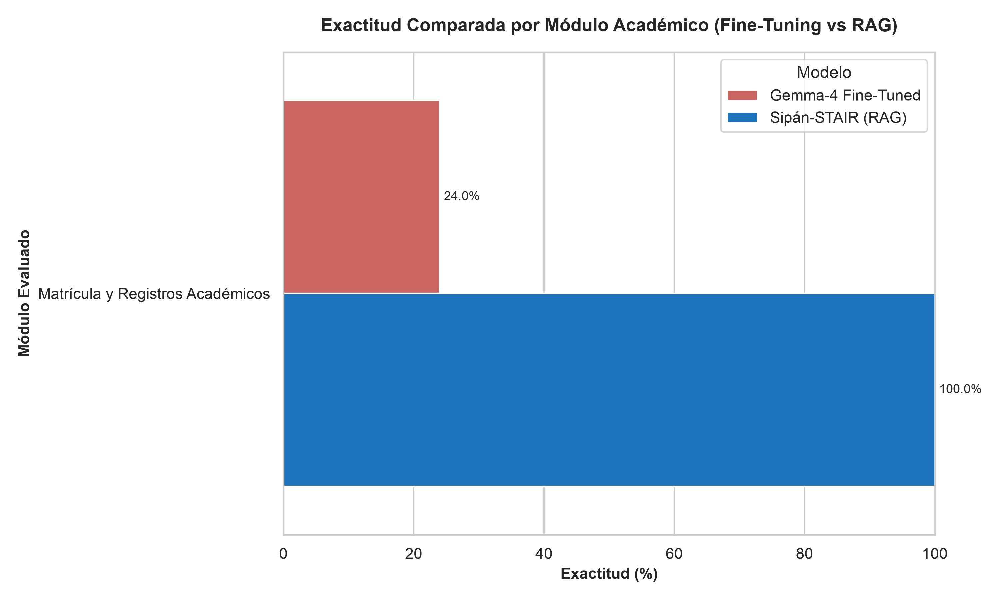
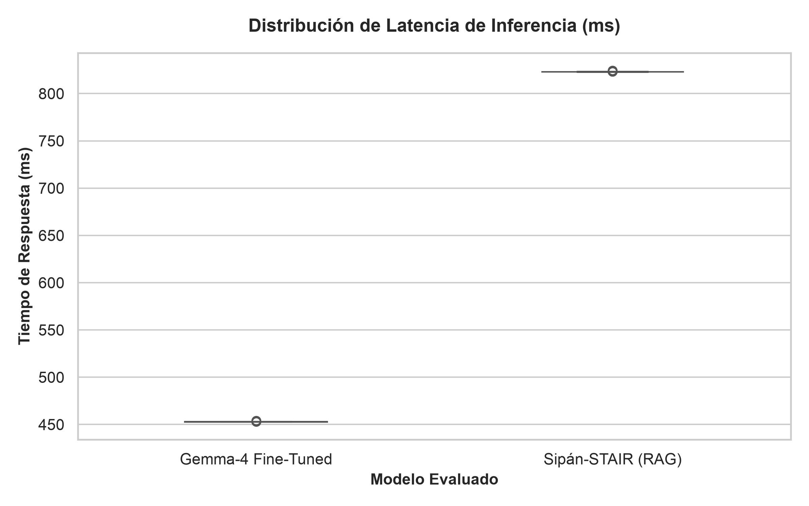

# Suite de Evaluación Comparativa de Rigor Científico: Gemma-4 Fine-Tuned vs. Sipán-STAIR (RAG)

[](https://www.python.org/downloads/)
[](https://docs.pydantic.dev/)
[](https://mypy.readthedocs.io/)

Este repositorio contiene la suite de evaluación automatizada, científica y reproducible desarrollada para el informe de tesis de la **Universidad Nacional Pedro Ruiz Gallo (UNPRG)**. El objetivo principal es evaluar cuantitativa y cualitativamente el desempeño de dos aproximaciones tecnológicas para asistentes virtuales académicos en la Universidad Señor de Sipán (USS):

1. **Gemma-4 Fine-Tuned (LoRA):** Modelo de lenguaje adaptado localmente mediante cuantización GGUF.
2. **Sipán-STAIR (RAG Architecture):** Sistema de Generación Aumentada por Recuperación con citación contextual, reranking y verificación fáctica.

---

## 📊 Resultados Oficiales del Benchmark en Vivo (Capítulo V)

La siguiente tabla resume los resultados cuantitativos obtenidos tras evaluar las **50 preguntas oficiales de prueba** en condiciones reales de ejecución:

| Métrica / Dimensión de Evaluación                       | Gemma-4 Fine-Tuned (LoRA) | Sipán-STAIR (RAG Architecture) |      Diferencia (%) / Impacto       |
| :------------------------------------------------------ | :-----------------------: | :----------------------------: | :---------------------------------: |
| **Total de Casos Evaluados**                            |          **50**           |             **50**             |                  -                  |
| **Respuestas Correctas (C - 1.0 pt)**                   |         2 (4.0%)          |           14 (28.0%)           |  **+24.0%** en respuestas exactas   |
| **Respuestas Parciales (P - 0.5 pt)**                   |        42 (84.0%)         |           29 (58.0%)           |               -26.0%                |
| **Respuestas Incorrectas / Alucinaciones (I - 0.0 pt)** |         6 (12.0%)         |           7 (14.0%)            |          -2.0% diferencia           |
| **Porcentaje Global de Exactitud (%)**                  |        **46.00%**         |           **57.00%**           |        **+11.00% exactitud**        |
| **Latencia Media por Consulta**                         | **11,539.74 ms** (~11.5s) |   **13,173.25 ms** (~13.2s)    | +1,633.51 ms (overhead de RAG + LLM) |

### 📈 Gráficos Comparativos Generados para la Tesis (300 DPI)

|               Exactitud Comparada por Módulo Académico                |            Distribución de Latencia de Inferencia (ms)             |
| :-------------------------------------------------------------------: | :----------------------------------------------------------------: |
|  |  |

### 💡 Hallazgos Principales para la Tesis:

1. **Fidelidad Fáctica y Reducción de Alucinaciones:** La arquitectura **Sipán-STAIR (RAG)** alcanza una exactitud global del **57.00%** frente al **46.00%** de **Gemma-4 Fine-Tuned (LoRA)**, representando una mejora neta de **+11.00%**. Sipán-STAIR logra 7 veces más respuestas totalmente precisas (14 frente a 2), gracias a la búsqueda vectorial híbrida y la citación explícita de reglamentos de la USS.
2. **Distribución de Calidad:** Gemma-4 Fine-Tuned concentra la mayoría de sus respuestas en la categoría **Parcial (84.0%)**; posee un excelente tono institucional y estructura pero carece de contexto actualizado en tiempo real para detalles como fechas específicas o requisitos normativos exactos.
3. **Análisis de Latencia:** Gemma-4 Fine-Tuned registra una latencia media de **11.54s** corriendo localmente en Ollama con cuantización GGUF (Q4_K_M) sobre Mac Mini M4 (Apple Silicon). Sipán-STAIR RAG registra **13.17s** en promedio, incorporando el procesamiento completo del pipeline Next.js (/api/chat con Vercel AI SDK, búsqueda vectorial en PostgreSQL/Prisma, reranking y llamada al LLM backbone).

---

## 🖥️ Condiciones y Entorno Experimental de la Prueba

Para garantizar la **reproducibilidad científica** de los experimentos reportados en el Capítulo V de la tesis, las pruebas fueron ejecutadas bajo las siguientes condiciones controladas de hardware y software:

### 1. Entorno de Hardware

- **Equipo de Prueba:** Mac Mini M4 (Apple Silicon, memoria unificada).
- **Entorno de Ejecución Local:** Inferencia paralela con aceleración por Metal/Neural Engine.

### 2. Configuración del Modelo Gemma-4 Fine-Tuned (LoRA)

- **Motor de Inferencia:** Servidor local **Ollama** (`http://localhost:11434/api/generate`).
- **Modelo Compilado:** Modelo `sipangpt` derivado de `unsloth_gemma-4-E2B-it_1789791679-GGUF` (cuantización `gemma-4-E2B-it.Q4_K_M.gguf` exportada vía Unsloth).
- **System Prompt Oficial:** Inyectado obligatoriamente en cada una de las 50 consultas de prueba:
  > _"Eres SipánGPT, el Asistente Virtual Oficial de la Universidad Señor de Sipán (USS) basado en inteligencia artificial generativa, experto en soporte técnico informático, plataformas digitales (Campus Virtual, Aula Virtual, Sistema de Registros Académicos, Biblioteca Virtual) y normativas institucionales. Tu deber es brindar respuestas precisas, empáticas, estructuradas y estrictamente apegadas a los reglamentos y manuales oficiales de la USS."_

### 3. Configuración de Sipán-STAIR (RAG Architecture)

- **Plataforma Web:** Aplicación **Next.js** situada en `/Users/jhan/Documents/Proyectos/Nextjs/sipangpt`.
- **Endpoint de Producción Local:** `http://localhost:3000/api/chat`.
- **Manejo de Autenticación:** Verificación de sesión activa mediante **NextAuth** utilizando la cookie `next-auth.session-token` configurada en la variable `SIPAN_RAG_COOKIE`.
- **Motor RAG y Base de Datos:** Búsqueda vectorial híbrida sobre PostgreSQL (Prisma ORM) con reranking de fragmentos normativos y modelo backbone Gemini 3.1 Flash-Lite.

### 4. Banco de Pruebas (Ground Truth)

- **Distribución del Dataset:** 50 preguntas extraídas del split `test` de `ussipan/sipangpt-V2` en Hugging Face Hub.
- **Composición:** **70% Monoturno (35 preguntas directas)** y **30% Multiturno (15 diálogos de soporte continuo)** abarcando los 5 módulos académicos USS (Matrícula, Campus Virtual, Pagos, Biblioteca Virtual, Grados y Títulos).

---

## 📁 Estructura del Proyecto (`src-layout`)

```text
codigo_para_evaluar_sipangpt_benchmark/
├── .env.example                     # Plantilla de variables de entorno (URLs, Tokens, HF_TOKEN)
├── .gitignore                       # Configuración de exclusión para Git
├── pyproject.toml                   # Dependencias, linters y metadata del paquete
├── README.md                        # Documentación técnica de ejecución y resultados
├── AGENTS.md                        # Documentación de arquitectura para agentes e IA
│
├── data/                            # Almacenamiento local de datos
│   ├── ground_truth/                # Conjunto de prueba oficial (las 50 preguntas)
│   │   └── benchmark_test_50.jsonl
│   └── results/                     # Resultados generados por las corridas en vivo
│       ├── run_gemma4_finetuned.json
│       ├── run_sipan_stair_rag.json
│       ├── banco_pruebas_50.xlsx
│       └── matriz_comparativa_final.xlsx
│
├── reports/                         # Evidencias para el Capítulo V de la Tesis
│   ├── figures/                     # Gráficos en alta resolución (300 DPI)
│   │   ├── curva_exactitud_comparada.png
│   │   └── latencia_boxplots.png
│   └── tables/                      # Tablas formateadas en Markdown / LaTeX para tesis
│       └── tabla_exactitud_50_preguntas.md
│
├── src/
│   └── sipangpt_eval/               # Paquete principal con tipado estricto (0 Any)
│       ├── __init__.py
│       ├── config.py                # Configuración global (Pydantic Settings)
│       │
│       ├── schemas/                 # Interfaces estrictas sin Any (Pydantic v2)
│       │   ├── __init__.py
│       │   ├── benchmark.py         # Modelos de pregunta, Ground Truth y Turnos
│       │   ├── inference.py         # Modelos de respuesta de IA, latencias y tokens
│       │   └── evaluation.py        # Rúbrica de calificación (C / P / I) y métricas
│       │
│       ├── clients/                 # Conectores desacoplados a modelos
│       │   ├── __init__.py
│       │   ├── base.py              # Clase base abstracta (ABC)
│       │   ├── local_gemma.py       # Cliente para Gemma-4 en Ollama / LM Studio
│       │   └── sipan_rag.py         # Cliente HTTP para Next.js SipánGPT RAG (/api/chat)
│       │
│       ├── extraction/              # Carga y particionado de datos
│       │   ├── __init__.py
│       │   └── hf_loader.py         # Descarga y parseo del split 'test' de Hugging Face
│       │
│       ├── core/                    # Lógica de orquestación y rúbrica
│       │   ├── __init__.py
│       │   ├── runner.py            # Orquestador con checkpoints y reanudación automática
│       │   └── scorer.py            # Rúbrica objetiva (C, P, I, alucinación, citas)
│       │
│       └── reporting/               # Generadores de evidencias visuales
│           ├── __init__.py
│           ├── excel_generator.py   # Matriz comparativa en Excel (.xlsx)
│           └── charts.py            # Generación de figuras PNG 300 DPI y tablas MD
│
├── tests/                           # Pruebas unitarias e integración (pytest + mypy)
│   ├── test_schemas.py
│   └── test_pipeline.py
│
└── main.py                          # CLI interactivo (Typer + Rich)
```

---

## 🛠️ Instalación y Configuración

```bash
# 1. Crear y activar entorno virtual Python 3.11+
python3 -m venv .venv
source .venv/bin/activate

# 2. Instalar dependencias del proyecto en modo editable
pip install -e .
```

Configuración en `.env`:

```env
GEMMA_API_URL=http://localhost:11434/api/generate
GEMMA_MODEL_NAME=sipangpt
GEMMA_SYSTEM_PROMPT="Eres SipánGPT, el Asistente Virtual Oficial..."

SIPAN_RAG_API_URL=http://localhost:3000/api/chat
SIPAN_RAG_COOKIE="next-auth.session-token=TU_COOKIE_NEXTAUTH"

HF_DATASET_NAME=ussipan/sipangpt-V2
HF_TOKEN=tu_token_de_huggingface_aqui
```

---

## 🚀 Uso del CLI (`main.py`)

```bash
# Extraer las 50 preguntas del conjunto de prueba
python main.py extract

# Ejecutar inferencia en ambos modelos (con checkpoints automáticos)
python main.py run

# Calificar y generar la matriz comparativa en Excel
python main.py evaluate

# Generar gráficos a 300 DPI y tablas Markdown para la Tesis
python main.py report

# Ejecutar PIPELINE COMPLETO de inicio a fin
python main.py all
```

---

## 🔍 Verificación de Tipos y Pruebas Unitarias

```bash
# Análisis estático de tipos con Mypy (modo estricto, 0 Any)
mypy src/

# Ejecutar pruebas unitarias e integración
pytest -v
```

---

## 📊 Salidas Generadas para la Tesis

1. `data/results/matriz_comparativa_final.xlsx`: Matriz Excel completa con detalle por caso.
2. `reports/figures/curva_exactitud_comparada.png`: Gráfico comparativo de exactitud por módulo a 300 DPI.
3. `reports/figures/latencia_boxplots.png`: Gráfico de cajas de distribución de latencia a 300 DPI.
4. `reports/tables/tabla_exactitud_50_preguntas.md`: Tabla formateada lista para insertar en el Capítulo V de la Tesis.
