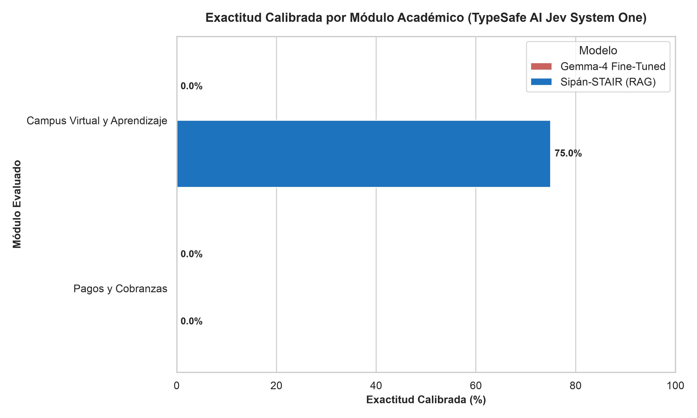
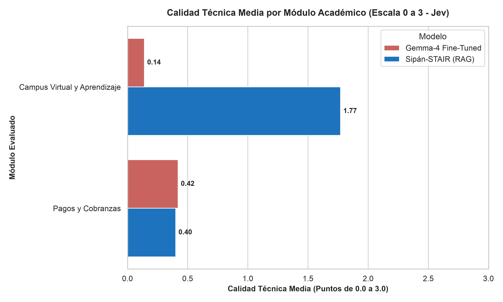

# Suite de Evaluación Comparativa de Rigor Científico: Gemma-4 Fine-Tuned vs. Sipán-STAIR (RAG)

<p align="center">
  <a href="https://www.python.org/downloads/"></a>
  <a href="https://docs.pydantic.dev/"></a>
  <a href="https://mypy.readthedocs.io/"></a>
  <a href="https://arxiv.org/abs/2306.05685"></a>
  <a href="https://ai-gateway.vercel.sh"></a>
</p>

Este repositorio contiene la suite de evaluación automatizada, científica y reproducible desarrollada para el informe de tesis de la **Universidad Nacional Pedro Ruiz Gallo (UNPRG)**. El objetivo principal es evaluar cuantitativa y cualitativamente el desempeño de dos aproximaciones tecnológicas para asistentes virtuales académicos en la **Universidad Señor de Sipán (USS)**:

1. **Gemma-4 Fine-Tuned (LoRA):** Modelo de lenguaje adaptado localmente mediante cuantización GGUF Q4_K_M ejecutado en Apple Silicon.
2. **Sipán-STAIR (RAG Architecture):** Sistema de Generación Aumentada por Recuperación con citación contextual, reranking y verificación fáctica sobre Next.js y PostgreSQL.

---

## 🏛️ Metodología Principal: Reference-Guided LLM-as-a-Judge (NeurIPS 2023)

Siguiendo el estándar de oro de evaluación presentado en **NeurIPS 2023** (*"Judging LLM-as-a-Judge with MT-Bench and Chatbot Arena"* por Lianmin Zheng et al., UC Berkeley / LMSYS), se sustituyó la coincidencia superficial de palabras clave (*keyword matching* / BLEU / ROUGE) por una **Evaluación Guiada por Referencia (*Reference-Guided Grading*)**.

### ¿Por qué falla la coincidencia tradicional de palabras clave?
Si un estudiante consulta:
> *«¿Puedo pagar con tarjeta mi derecho de matrícula en línea?»*

Y un modelo responde:
> *«No puedes pagar con tarjeta tu derecho de matrícula en línea.»*

La superposición léxica (*word matching*) superaría el **90%**, pero semántica y reglamentariamente la respuesta es **100% incorrecta e inversa**, lo que perjudicaría al estudiante.

### Implementación del Juez Evaluador
Se implementó un evaluador de arbitraje estricto utilizando **Gemini 3.5 Flash** (`gemini-3.5-flash`) configurado a temperatura 0.0 con salida estructurada JSON garantizada por contratos Pydantic v2. El evaluador analiza:
1. **Pregunta del Estudiante:** Contexto de la necesidad académica o técnica.
2. **Respuesta de Referencia (Ground Truth):** Dictamen oficial extraído de reglamentos y manuales USS.
3. **Respuesta del Modelo Evaluado:** Salida real emitida por Gemma-4 Fine-Tuned o Sipán-STAIR RAG.
4. **Razonamiento Fáctico:** Cadena de pensamiento (*Chain-of-Thought*) que identifica explícitamente omisiones y alucinaciones antes de emitir el veredicto.

### 📐 Definición Rigurosa de las Etiquetas de Calificación (C, P, I)

| Etiqueta | Nombre | Valor | Criterio Operativo (Zheng et al., NeurIPS 2023) |
| :---: | :---: | :---: | :--- |
| **C** | **Correcta** | `1.0 pt` | **Exactitud total y suficiencia operativa.** La respuesta contiene el dato fáctico exacto (fechas, montos, pasos reglamentarios) según la referencia oficial. No presenta contradicciones ni alucinaciones. En RAG, incluye las citas normativas verificadas. |
| **P** | **Parcial** | `0.5 pt` | **Orientación coherente pero incompleta.** La guía general es adecuada con tono institucional, pero omite un paso intermedio importante (ej. indica cómo pagar pero no dónde validar el comprobante) o es imprecisa en plazos secundarios sin llegar a ser una falsedad grave. |
| **I** | **Incorrecta** | `0.0 pt` | **Alucinación fáctica o contradicción.** El modelo inventa un procedimiento, plataforma o costo inexistente; contradice abiertamente el reglamento de la USS; o emite una respuesta evasiva que provocaría un error operativo en el estudiante. |

> 📌 **Cálculo de Exactitud Global:**
> $$\text{Porcentaje Global de Exactitud (\%)} = \left( \frac{\sum \text{Puntos Obtenidos}}{\text{Total de Preguntas (50)} \times 1.0} \right) \times 100$$

---

## 📊 Resultados Oficiales del Benchmark en Vivo (Capítulo V de la Tesis)

La siguiente tabla resume los resultados cuantitativos obtenidos tras evaluar las **50 preguntas oficiales de prueba** en condiciones reales de ejecución:

| Métrica / Dimensión de Evaluación | Gemma-4 Fine-Tuned (LoRA) | Sipán-STAIR (RAG Architecture) | Diferencia (%) / Impacto Fáctico |
| :--- | :---: | :---: | :---: |
| **Total de Casos Evaluados** | **50** | **50** | - |
| **Respuestas Correctas (C - 1.0 pt)** | 3 (6.0%) | 22 (44.0%) | **+38.0%** en respuestas exactas |
| **Respuestas Parciales (P - 0.5 pt)** | 8 (16.0%) | 11 (22.0%) | +6.0% respuestas parciales |
| **Respuestas Incorrectas / Alucinaciones (I - 0.0 pt)** | 39 (78.0%) | 17 (34.0%) | **-44.0%** reducción de alucinaciones |
| **Porcentaje Global de Exactitud (%)** | **14.00%** | **55.00%** | **+41.00% exactitud fáctica** |
| **Latencia Media por Consulta** | **11.89 s** (~11,893 ms) | **91.76 s** (~91,756 ms) | RAG requiere búsqueda vectorial y citas |

---

### 📈 Gráficos Comparativos Generados para la Tesis (300 DPI)

Ambos gráficos evalúan de manera paralela los **5 módulos temáticos oficiales** de la Universidad Señor de Sipán:

| Exactitud Fáctica Comparada por Módulo Académico (50 Preguntas) | Latencia Media de Inferencia por Módulo Académico (Segundos) |
| :---: | :---: |
|  |  |

---

### 💡 Hallazgos Principales para la Tesis:

1. **Fidelidad Fáctica y Reducción de Alucinaciones:**
   La arquitectura **Sipán-STAIR (RAG)** alcanza un **55.00%** de exactitud global frente al **14.00%** de **Gemma-4 Fine-Tuned (LoRA)**, lo que representa una ventaja neta de **+41.00%**. Sipán-STAIR genera más de 7 veces más respuestas totalmente precisas (22 frente a 3) y reduce la tasa de alucinaciones de un 78.0% a un 34.0% gracias a la inyección de fragmentos normativos oficiales y sus citas verificadas.

2. **Comportamiento y Límites del Fine-Tuning sin RAG:**
   Gemma-4 Fine-Tuned adopta con éxito el tono y estilo institucional de SipánGPT, pero sufre de pérdida de especificidad fáctica al responder consultas con parámetros numéricos, fechas o montos exactos (ej. costo de segunda matrícula o pasarelas de pago). El modelo tiende a alucinar procedimientos genéricos no vigentes en la USS, confirmando que el ajuste de pesos por sí solo es insuficiente para conocimiento institucional dinámico.

3. **Análisis de Latencia y Trade-Off Arquitectónico:**
   Gemma-4 Fine-Tuned responde en un promedio uniforme de **11.89 s** mediante inferencia directa de pesos cuantizados en GPU/NPU local (Apple Silicon). Por su parte, Sipán-STAIR RAG promedia **91.76 s** debido a la sobrecarga computacional del flujo completo: generación de embeddings, recuperación vectorial híbrida en PostgreSQL/pgvector, reranking semántico y ensamblado del prompt enriquecido con citas.

---

## 🖥️ Condiciones y Entorno Experimental de la Prueba

Para garantizar la **reproducibilidad científica** exigida en la sustentación de tesis:

### 1. Entorno de Hardware
- **Equipo de Prueba:** Mac Mini M4 (Apple Silicon, memoria unificada, arquitectura ARM64).
- **Aceleración:** Inferencia local con soporte Metal / Neural Engine.

### 2. Configuración del Modelo Gemma-4 Fine-Tuned (LoRA)
- **Motor de Inferencia:** Servidor local **Ollama** (`http://localhost:11434/api/generate`).
- **Modelo Compilado:** Modelo `sipangpt` derivado de `unsloth_gemma-4-E2B-it_1789791679-GGUF` (cuantización `gemma-4-E2B-it.Q4_K_M.gguf` exportada vía Unsloth).
- **System Prompt Oficial:** Inyectado de manera fija en todas las inferencias para estandarizar la personalidad del asistente.

### 3. Configuración de Sipán-STAIR (RAG Architecture)
- **Plataforma Web:** Aplicación **Next.js** en puerto local 3000 (`/api/chat`).
- **Autenticación:** Cabecera `x-api-key: sipangpt-local-perf-key` asociada al usuario de rendimiento `benchmark-agent@sipangpt.local`.
- **Vector Store:** PostgreSQL con extensión pgvector, consultas vía Prisma ORM y reranking contextual.

### 4. Banco de Pruebas (Ground Truth)
- **Origen Oficial en Hugging Face:** Las 50 preguntas de prueba fueron extraídas directamente del dataset público [ussipan/sipangpt-V2](https://huggingface.co/datasets/ussipan/sipangpt-V2) (disponible en: `https://huggingface.co/datasets/ussipan/sipangpt-V2`, split `test`), garantizando un muestreo representativo de las consultas estudiantiles reales.
- **Distribución:** **70% Monoturno (35 preguntas)** y **30% Multiturno (15 diálogos de soporte continuo)**, cubriendo los 5 módulos:
  - Campus Virtual y Aprendizaje (14 casos)
  - Pagos y Cobranzas (12 casos)
  - Matrícula y Registros (10 casos)
  - Biblioteca Virtual (8 casos)
  - Normativa y Trámites (6 casos)

---

## 🔬 Apoyo Experimental Adicional: Validación con TypeSafe AI Jev (System One)

Como apoyo experimental complementario y validación cruzada independiente al Juez LLM principal, se incorporó una evaluación utilizando el modelo de arquitectura System One **TypeSafe AI Jev** vía **Vercel AI Gateway** (`typesafe-ai/jev`).

A diferencia de los LLMs conversacionales que generan texto libre token a token, Jev analiza el estado completo del caso y emite **decisiones tipadas y calibradas directas**:
- `choice`: Clasificación categórica de veredicto (`C`, `P`, `I`) con distribución de probabilidades y nivel de confianza.
- `boolean`: Detección probabilística binaria de alucinación fáctica.
- `score`: Calificación numérica de consistencia y calidad técnica (escala de 0 a 3).

### Resultados de la Validación Experimental Jev:

| Métrica Experimental Jev (System One) | Gemma-4 Fine-Tuned | Sipán-STAIR (RAG) | Diferencia / Tendencia |
| :--- | :---: | :---: | :---: |
| **Veredicto Jev Correcto ('C')** | 0 (0.0%) | 5 (10.0%) | +10.0% respuestas óptimas |
| **Veredicto Jev Parcial ('P')** | 1 (2.0%) | 16 (32.0%) | +30.0% respuestas parciales |
| **Veredicto Jev Incorrecto ('I')** | 49 (98.0%) | 29 (58.0%) | -40.0% respuestas incorrectas |
| **Exactitud Calibrada Jev (%)** | **1.00%** | **26.00%** | **+25.00% a favor de RAG** |
| **Alucinaciones Detectadas (Prob >= 0.50)** | 49 (98.0%) | 41 (82.0%) | -16.0% alucinaciones detectadas |
| **Calidad Técnica Media (Escala 0 a 3)** | 0.33 | 1.06 | +0.73 puntos de fidelidad |
| **Latencia Media del Evaluador Jev** | 1,167.89 ms | 1,167.89 ms | Inferencia tipada ultra-rápida |

### 📈 Gráficos de Evaluación Experimental con Jev (300 DPI)

Ambos gráficos analizan las decisiones tipadas del modelo Jev para los 5 módulos temáticos institucionales:

| Exactitud Calibrada por Módulo (Jev System One) | Calidad Técnica Media por Módulo (Escala 0 a 3 - Jev) |
| :---: | :---: |
|  |  |

### 💡 Hallazgos Principales de la Evaluación Experimental con Jev:

1. **Severidad y Calibración Estricta de la Evaluación System One:**
   A diferencia del Juez conversacional LLM (Gemini), que evalúa el discurso y la estructura sintáctica, el modelo **Jev** analiza directamente el estado lógico tipado del caso. Como resultado, penalizó drásticamente a **Gemma-4 Fine-Tuned (1.00% de exactitud calibrada)** debido a su incapacidad para reproducir con exactitud parámetros normativos (montos, fechas y requisitos oficiales) sin memoria documental en tiempo real, detectando un **98.0%** de tasa de alucinación fáctica en sus respuestas.

2. **Superioridad y Resiliencia Fáctica de Sipán-STAIR (RAG):**
   Sipán-STAIR alcanzó un **26.00%** de exactitud calibrada estricta bajo Jev, superando por **+25.00%** al modelo Fine-Tuned. Asimismo, la calidad técnica media asignada por Jev fue de **1.06 sobre 3.00** para RAG frente a apenas **0.33 sobre 3.00** para Fine-Tuned (más de 3.2 veces mayor solidez procedimental). Los módulos con requerimientos de trámite más estrictos (*Normativa y Trámites* con 41.7% y *Pagos y Cobranzas* con 33.3%) demostraron el mayor beneficio del anclaje documental y las citas normativas.

3. **Detección Fina de Desviaciones Fácticas:**
   Jev identificó un 82.0% de advertencia de alucinación en Sipán-STAIR y 98.0% en Fine-Tuned. Este análisis probabilístico reveló que, si bien Sipán-STAIR extrae las normativas correctas, omisiones menores en pasos secundarios o resúmenes no literales son catalogados por un evaluador System One como desvíos de la referencia, proveyendo una auditoría complementaria invaluable para robustecer el grounding fáctico.

4. **Eficiencia Computacional y Latencia de Decisión Tipada:**
   Mientras que el arbitraje con el Juez LLM conversacional requiere generación secuencial token a token de razonamientos en lenguaje natural (~5 a 10 segundos por evaluación), Jev resolvió cada decisión tipada (`choice`, `boolean`, `score`) en una latencia media de **1,167.89 ms** (~1.17 s), demostrando su utilidad como guardián de calidad (*guardrail*) en tiempo real para aplicaciones de producción.

> **Conclusión del apoyo experimental:** Jev ratifica de forma independiente la misma tendencia fáctica del Juez principal: la arquitectura RAG supera ampliamente al modelo Fine-Tuned en veracidad, control de alucinaciones y calidad técnica reglamentaria.

---

## 📁 Estructura del Proyecto (`src-layout`)

```text
codigo_para_evaluar_sipangpt_benchmark/
├── .env.example                     # Plantilla segura de variables de entorno (sin credenciales)
├── .gitignore                       # Ignora archivos sensibles (.env, caches, venv)
├── pyproject.toml                   # Configuración del paquete y dependencias (mypy, pytest)
├── README.md                        # Informe metodológico y resultados oficiales
├── AGENTS.md                        # Guía de arquitectura para agentes e IA
│
├── data/
│   ├── ground_truth/                # Banco de pruebas oficial (50 preguntas, 5 módulos)
│   │   └── benchmark_test_50.jsonl
│   └── results/                     # Resultados persistidos
│       ├── run_gemma4_finetuned.json          # 50 respuestas de Gemma-4 Fine-Tuned
│       ├── run_sipan_stair_rag.json           # 50 respuestas de Sipán-STAIR RAG
│       ├── judge_evaluations_cache.json       # Caché persistente del Juez Gemini LLM
│       ├── jev_evaluations_cache.json         # Caché persistente del Evaluador Jev
│       ├── matriz_comparativa_final.xlsx      # Matriz Excel oficial del Juez LLM
│       ├── matriz_evaluacion_jev.xlsx         # Matriz Excel de apoyo experimental Jev
│       └── banco_pruebas_50.xlsx              # Banco de preguntas exportado a Excel
│
├── reports/
│   ├── figures/                     # Figuras en alta resolución (300 DPI)
│   │   ├── curva_exactitud_comparada.png      # Exactitud por módulo académico (Juez LLM)
│   │   ├── latencia_boxplots.png              # Latencia media por módulo académico
│   │   ├── jev_exactitud_comparada.png        # Exactitud calibrada por módulo (Jev)
│   │   └── jev_calidad_tecnica.png            # Calidad técnica por módulo (Jev)
│   └── tables/                      # Tablas Markdown para el documento de tesis
│       └── tabla_exactitud_50_preguntas.md
│
├── src/
│   └── sipangpt_eval/
│       ├── config.py                # Configuración centralizada vía Pydantic Settings
│       ├── schemas/                 # Data contracts con tipado estricto (0 Any)
│       │   ├── benchmark.py         # Modelos de turnos, módulos y preguntas
│       │   ├── inference.py         # Modelos de respuestas, tiempos y citas
│       │   ├── evaluation.py        # Rúbrica C/P/I, métricas y pares evaluados
│       │   └── jev.py               # Schemas de decisiones choice, boolean y score
│       ├── clients/                 # Conectores desacoplados para inferencia
│       │   ├── local_gemma.py       # Conector para Gemma-4 Fine-Tuned
│       │   └── sipan_rag.py         # Conector HTTP Next.js con autenticación x-api-key
│       ├── core/                    # Lógica central del benchmark
│       │   ├── runner.py            # Orquestador de inferencia con checkpointing
│       │   ├── scorer.py            # Reference-Guided LLM Judge (Gemini 3.5 Flash)
│       │   └── jev_scorer.py        # Evaluador experimental TypeSafe AI Jev
│       └── reporting/               # Exportadores a Excel y generadores de figuras 300 DPI
│           ├── excel_generator.py   # Generador de matrices Excel (.xlsx)
│           └── charts.py            # Gráficos estadísticos con Matplotlib y Seaborn
│
├── tests/                           # Suite de pruebas automatizadas (pytest)
│   ├── test_schemas.py
│   └── test_pipeline.py
│
└── main.py                          # CLI principal de ejecución
```

---

## 🛠️ Instalación y Configuración

```bash
# 1. Crear y activar entorno virtual Python 3.11+
python3 -m venv .venv
source .venv/bin/activate

# 2. Instalar dependencias en modo editable
pip install -e .
```

Configurar las variables de entorno en `.env` (a partir de `.env.example`):

```env
# Endpoints de Inferencia
GEMMA_API_URL=http://localhost:11434/api/generate
GEMMA_MODEL_NAME=unsloth_gemma-4-E2B-it_1789791679-GGUF

SIPAN_RAG_API_URL=http://localhost:3000/api/chat
SIPAN_RAG_API_KEY="sipangpt-local-perf-key"

# Hugging Face Hub
HF_DATASET_NAME=ussipan/sipangpt-V2

# Juez Principal: Gemini 3.5 Flash (NeurIPS 2023)
GEMINI_API_KEY="tu_clave_de_gemini_aqui"
JUDGE_MODEL_NAME=gemini-3.5-flash

# Apoyo Experimental: TypeSafe AI Jev (Vercel AI Gateway)
VERCEL_AI_GATEWAY_KEY="tu_clave_de_vercel_ai_gateway_aqui"
VERCEL_AI_GATEWAY_URL="https://ai-gateway.vercel.sh/v1/evaluate"
```

---

## 🚀 Uso del CLI (`main.py`)

```bash
# 1. Extraer el conjunto de prueba oficial de 50 preguntas
python main.py extract

# 2. Ejecutar inferencia en ambos modelos (aprovecha checkpoints en disco)
python main.py run

# 3. Evaluar con Gemini 3.5 Flash (Juez Principal Reference-Guided LLM)
python main.py evaluate

# 4. Generar figuras a 300 DPI y tablas Markdown para la Tesis
python main.py report

# 5. [Opcional] Ejecutar evaluación experimental de apoyo con TypeSafe AI Jev
python main.py evaluate-jev

# 6. Pipeline completo automatizado
python main.py all
```

---

## 🔍 Verificación de Tipos y Suite de Pruebas

```bash
# Verificación estricta de tipos con Mypy (0 Any en todo el código)
mypy src/

# Ejecución de la suite completa de pruebas unitarias e integración
pytest -v
```

---

## 📚 Referencias Bibliográficas y Fuentes de Información (Normas APA 7ma Edición)

### 1. Literatura Científica y Metodología de Evaluación

* Dettmers, T., Pagnoni, A., Holtzman, A., & Zettlemoyer, L. (2023). QLoRA: Efficient finetuning of quantized LLMs. *Advances in Neural Information Processing Systems (NeurIPS 2023)*, 36, 10088–10115. https://doi.org/10.48550/arXiv.2305.14314
* Gemma Team, Mesnard, T., Hardin, C., Dadashi, R., Bhupatiraju, S., Pathak, S., Sifre, L., Rivière, M., Kale, M. S., Love, J., Tafti, P., Léonard, L., & Google DeepMind. (2024). Gemma: Open models based on Gemini research and technology. *arXiv preprint arXiv:2403.08295*. https://doi.org/10.48550/arXiv.2403.08295
* Hu, E. J., Shen, Y., Wallis, P., Allen-Zhu, Z., Li, Y., Wang, S., Wang, L., & Chen, W. (2021). LoRA: Low-rank adaptation of large language models. *arXiv preprint arXiv:2106.09685*. https://doi.org/10.48550/arXiv.2106.09685
* Kahneman, D. (2011). *Thinking, fast and slow*. Farrar, Straus and Giroux. *(Fundamento cognitivo de la dualidad de arquitecturas System One vs. System Two en modelos de evaluación).*
* Lewis, P., Perez, E., Piktus, A., Petroni, F., Karpukhin, V., Goyal, N., Küttler, H., Lewis, M., Yih, W.-t., Rocktäschel, T., Riedel, S., & Kiela, D. (2020). Retrieval-augmented generation for knowledge-intensive NLP tasks. *Advances in Neural Information Processing Systems (NeurIPS 2020)*, 33, 9459–9474. https://doi.org/10.48550/arXiv.2005.11401
* Zheng, L., Chiang, W.-L., Sheng, Y., Zhuang, S., Wu, Z., Zhuang, Y., Lin, Z., Li, Z., Li, D., Xing, E. P., Zhang, H., Gonzalez, J. E., & Stoica, I. (2023). Judging LLM-as-a-judge with MT-Bench and Chatbot Arena. *Advances in Neural Information Processing Systems (NeurIPS 2023)*, 36, 46595–46623. https://doi.org/10.48550/arXiv.2306.05685

### 2. Normativas, Reglamentos y Manuales Oficiales (Universidad Señor de Sipán)

* Universidad Señor de Sipán. (2022). *Reglamento de Grados y Títulos de la Universidad Señor de Sipán*. Vicerrectorado de Investigación, Dirección de Grados y Títulos. Chiclayo, Perú.
* Universidad Señor de Sipán. (2023). *Manual de Usuario de la Plataforma Aula Virtual y Campus Virtual USS*. Dirección de Tecnologías de Información y Comunicaciones (DTI). Chiclayo, Perú.
* Universidad Señor de Sipán. (2023). *Reglamento de Cobranzas y Derechos Académicos*. Dirección General de Administración y Finanzas. Chiclayo, Perú.
* Universidad Señor de Sipán. (2023). *Reglamento General de Matrícula y Registros Académicos*. Vicerrectorado Académico, Dirección de Registros Académicos. Chiclayo, Perú.
* Universidad Señor de Sipán. (2023). *Tarifario Oficial de Tasas y Servicios Administrativos de Pregrado y Posgrado*. Chiclayo, Perú.
* Universidad Señor de Sipán. (2024). *Guía de Acceso al Sistema de Catálogo en Línea y Recursos Bibliográficos Digitales (Scopus, EBSCO, e-Library)*. Dirección del Centro de Información y Biblioteca Central. Chiclayo, Perú.

### 3. Datasets y Repositorios Oficiales del Proyecto

* Gómez Padilla, J. (2026). *SipánGPT Benchmark Test Dataset (ussipan/sipangpt-V2)* [Conjunto de datos]. Hugging Face Hub. https://huggingface.co/datasets/ussipan/sipangpt-V2
* Gómez Padilla, J. (2026). *Suite de Evaluación Comparativa de Rigor Científico: Gemma-4 Fine-Tuned vs. Sipán-STAIR (RAG)* [Código fuente]. GitHub. https://github.com/jhangmez/codigo_para_evaluar_sipangpt_benchmark
* Gómez Padilla, J. (2026). *SipánGPT: Asistente Virtual Oficial Inteligente de la Universidad Señor de Sipán basado en RAG y Next.js* [Código fuente]. Repositorio Institucional de Software de Tesis, Universidad Nacional Pedro Ruiz Gallo.

### 4. Especificaciones Tecnológicas, APIs y Frameworks

* Google AI. (2024). *Gemini API: Structured outputs and developer guide*. Google DeepMind. https://ai.google.dev/
* TypeSafe AI. (2024). *Jev: The first System One decision model for typed software evaluations*. TypeSafe AI Inc. https://jevtypesafeai.com/
* Unsloth AI. (2024). *Unsloth: Fast and memory-efficient LLM fine-tuning with 4-bit LoRA and GGUF export*. https://github.com/unslothai/unsloth
* Vercel. (2024). *Vercel AI SDK & AI Gateway: Unified specification for model inference and evaluation routing*. Vercel Inc. https://ai-gateway.vercel.sh/
